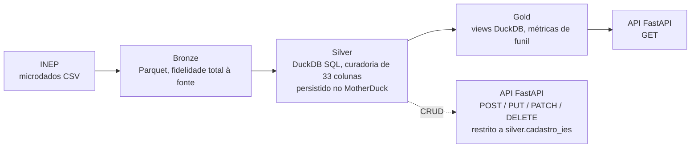

# Censo da Educação Superior — INEP

Pipeline de dados sobre o Censo da Educação Superior do INEP, com arquitetura em camadas (bronze/silver/gold) em DuckDB e API de leitura + CRUD em FastAPI.

## Sumário

- [Contexto do projeto e dataset](#contexto-do-projeto-e-dataset)
- [Stack tecnológica](#stack-tecnológica)
- [Arquitetura](#arquitetura)
- [Status atual](#status-atual)
- [Modelo de dados](#modelo-de-dados)
- [Estrutura de pastas](#estrutura-de-pastas)
- [Como rodar](#como-rodar)
- [Autor / contato](#autor--contato)

## Contexto do projeto e dataset

Projeto desenvolvido como desafio de engenharia de dados, com o objetivo de praticar fora da stack já dominada. O critério que resolve qualquer dúvida de escopo é o resumo do próprio desafio: **entregar resultado da forma mais simples e econômica possível**.

Requisitos definidos para o desafio:

- Fonte de dados real, não vinda do Kaggle e não pré-organizada — a mais crua possível.
- CRUD completo exposto via API (não só leitura).
- Arquitetura em camadas (bronze/silver/gold).
- Todo tratamento de dados em **SQL**, não em pandas.
- Banco em **DuckDB** (decisão explícita — sem SQLAlchemy/Postgres).
- Deploy da API na nuvem, em tier gratuito (Render ou similar).

**Fonte:** [Censo da Educação Superior](https://www.gov.br/inep/pt-br/acesso-a-informacao/dados-abertos/microdados/censo-da-educacao-superior), portal de dados abertos do INEP. Microdados públicos, distribuídos como CSV (`;` como delimitador, encoding Latin-1) dentro de um zip por ano de referência.

Duas tabelas de microdados são usadas, unidas por `CO_IES`:

- `cadastro_ies` — cadastro de instituições de ensino superior (84 colunas na fonte).
- `cadastro_cursos` — cadastro de cursos (226 colunas na fonte).

## Stack tecnológica

| Camada | Ferramenta |
|---|---|
| Linguagem | Python 3.12+ |
| Ingestão/tratamento | Python + DuckDB (`read_csv()`, `COPY ... TO`) |
| HTTP | `requests` + `requests-cache` (cache SQLite local) |
| TLS | `truststore` (adapter customizado, ver [Arquitetura](#arquitetura)) |
| Banco | DuckDB local (dev) / MotherDuck (produção) — planejado a partir da camada silver |
| API | FastAPI — planejado |
| Deploy | Render (free tier) — planejado |
| Gerenciamento de pacotes | `pip` + `requirements.txt` atualmente; migração para `uv` + `pyproject.toml` planejada |

## Arquitetura



### Bronze — implementada

Em [`pipe/bronze.py`](pipe/bronze.py), a função `create_bronze()`:

1. Verifica idempotência: se os dois arquivos Parquet de saída (IES e cursos) já existem em `data/bronze/`, não faz nada.
2. Baixa o zip completo do Censo 2024 direto do domínio `download.inep.gov.br`, usando uma sessão HTTP com cache permanente (`requests_cache`, backend SQLite em `data/cache/`) — evita baixar o zip (que é grande) mais de uma vez durante o desenvolvimento.
3. Usa um adapter TLS customizado (`INEPTLSAdapter`) na sessão — necessário porque o handshake padrão contra o servidor do INEP falha (ver detalhe abaixo).
4. Extrai em memória os dois CSVs de interesse do zip, sem gravar o zip inteiro em disco.
5. Converte para Parquet via DuckDB: cada CSV é lido com `read_csv()` (delimitador `;`, encoding `latin-1` — formato padrão dos microdados do INEP) com `SELECT *`, preservando **todas** as colunas da fonte — o corte de colunas é responsabilidade da camada silver, não da bronze.

**Adaptador TLS customizado** ([`pipe/utils/tls_adapter.py`](pipe/utils/tls_adapter.py)): o servidor de download do INEP derruba a conexão quando o cliente tenta negociar TLS 1.3, então o adapter trava a versão máxima em TLS 1.2. O certificado `rnp_icpedu_gr46_ov_tls_ca_2025.pem` resolve um problema separado, específico de redes acadêmicas que fazem inspeção TLS (o tráfego passa por um proxy que troca o certificado real por um assinado por uma CA da RNP) — quem roda o projeto fora desse tipo de rede não precisa dele; o adapter carrega o arquivo, mas ele fica sem uso e não interfere na conexão.

### Silver — planejada

DuckDB lê os CSVs via SQL (`read_csv()`, mesmo delimitador/encoding da bronze), aplica a curadoria de colunas definida em [`pipe/utils/etl_utils.py`](pipe/utils/etl_utils.py) — 33 das 310 colunas da fonte (~89% de redução) — e persiste as tabelas resultantes no MotherDuck.

O CRUD exposto pela API é restrito à tabela `cadastro_ies`, e dentro dela só aos campos `NO_IES`, `SG_IES`, `TP_ORGANIZACAO_ACADEMICA`, `TP_REDE` e `TP_CATEGORIA_ADMINISTRATIVA` — são os únicos campos com semântica de edição cadastral genuína (nome, sigla, tipo de organização, rede, categoria administrativa). O restante da tabela (geografia, `CO_IES` como PK, métricas de docentes) é somente-leitura mesmo estando na camada que recebe escrita. `cadastro_cursos` é majoritariamente agregação estatística (matrículas, ingressantes, concluintes) e fica inteiramente somente-leitura — editar esses números não teria semântica de negócio válida.

### Gold — planejada

Views DuckDB sobre as tabelas silver, também no MotherDuck, consumidas pelas rotas de leitura (GET) da API. `cadastro_cursos` fornece o funil de conversão natural para qualquer view analítica sobre cursos: `QT_VG_TOTAL → QT_INSCRITO_TOTAL → QT_ING → QT_MAT → QT_CONC` (vagas → inscritos → ingressantes → matrículas → concluintes).

### API — planejada

FastAPI, deploy no Render (free tier). Leituras (`GET`) servidas pela camada gold; CRUD (`POST`/`PUT`/`PATCH`/`DELETE`) escreve na camada silver, tabela `cadastro_ies`, com rotas parametrizadas (evitando duplicar handler por entidade) e validação de que o campo alvo está na lista de campos editáveis acima.

## Status atual

- [x] Camada bronze (download + fidelidade total à fonte + Parquet)
- [ ] Camada silver (SQL de curadoria, persistência no MotherDuck) — DDL em elaboração em [`sql/ddl/silver.sql`](sql/ddl/silver.sql)
- [ ] Camada gold (views analíticas)
- [ ] API FastAPI (leitura via gold + CRUD paramétrico em `cadastro_ies`)
- [ ] Deploy no Render

## Dicionário de dados

### `cadastro_ies` (17 colunas)

| Coluna | Tipo | Descrição | Camada de origem |
|---|---|---|---|
| `NU_ANO_CENSO` | Num(4) | Ano de referência do Censo | Silver |
| `CO_IES` | Num(8) — PK | Código único de identificação da IES | Silver |
| `NO_IES` | Char(200) | Nome da IES *(editável via CRUD)* | Silver |
| `SG_IES` | Char(20) | Sigla da IES *(editável via CRUD)* | Silver |
| `TP_ORGANIZACAO_ACADEMICA` | Num(1) | Tipo de organização acadêmica *(editável via CRUD)* | Silver |
| `TP_REDE` | Num(1) | Rede de ensino *(editável via CRUD)* | Silver |
| `TP_CATEGORIA_ADMINISTRATIVA` | Num(1) | Categoria administrativa da IES *(editável via CRUD)* | Silver |
| `NO_REGIAO_IES` | Char(20) | Nome da região geográfica da sede administrativa | Silver |
| `CO_REGIAO_IES` | Num(2) | Código da região geográfica da sede | Silver |
| `NO_UF_IES` | Char(50) | Nome da UF da sede administrativa | Silver |
| `SG_UF_IES` | Char(2) | Sigla da UF da sede | Silver |
| `CO_UF_IES` | Num(2) | Código da UF da sede | Silver |
| `NO_MUNICIPIO_IES` | Char(150) | Nome do município da sede | Silver |
| `CO_MUNICIPIO_IES` | Num(7) | Código IBGE do município da sede | Silver |
| `IN_CAPITAL_IES` | Num(2) | Sede localizada na capital da UF? | Silver |
| `QT_DOC_TOTAL` | Num(8) | Quantidade total de docentes (em exercício e afastados) | Silver |
| `QT_DOC_EXE` | Num(8) | Quantidade de docentes em exercício | Silver |

Regras de negócio (o que é editável e por quê) estão detalhadas em [Silver — planejada](#silver--planejada).

### `cadastro_cursos` (16 colunas, somente leitura)

| Coluna | Tipo | Descrição | Camada de origem |
|---|---|---|---|
| `NU_ANO_CENSO` | Num(4) | Ano de referência do Censo | Silver |
| `CO_IES` | Num(8) — FK | Código da instituição (join com `cadastro_ies`) | Silver |
| `NO_CURSO` | Char(200) | Nome do curso | Silver |
| `CO_CURSO` | Num(8) — PK | Código do curso | Silver |
| `QT_CURSO` | Num(4) | Número de cursos (linha agregadora) | Silver |
| `TP_GRAU_ACADEMICO` | Num(1) | Grau acadêmico conferido | Silver |
| `IN_GRATUITO` | Num(1) | Curso é gratuito? | Silver |
| `TP_MODALIDADE_ENSINO` | Num(1) | Modalidade de ensino | Silver |
| `TP_NIVEL_ACADEMICO` | Num(1) | Nível acadêmico | Silver |
| `CO_CINE_AREA_GERAL` | Char(2) | Código da área geral (classificação CINE/Unesco) | Silver |
| `NO_CINE_AREA_GERAL` | Char(120) | Nome da área geral (classificação CINE/Unesco) | Silver |
| `QT_VG_TOTAL` | Num(8) | Total de vagas oferecidas | Silver |
| `QT_INSCRITO_TOTAL` | Num(8) | Total de inscritos | Silver |
| `QT_ING` | Num(8) | Quantidade de ingressantes (soma de ingressos em 01/jan e 01/jul do ano-referência) | Silver |
| `QT_MAT` | Num(8) | Quantidade de matrículas (alunos com vínculo "Cursando" ou "Formado") | Silver |
| `QT_CONC` | Num(8) | Quantidade de concluintes | Silver |

## Estrutura de pastas

```
higher-education-census/
├── main.py                     # ponto de entrada do pipeline
├── requirements.txt
├── .env.example                 # variáveis do MotherDuck (usadas a partir da camada silver)
├── pipe/
│   ├── bronze.py                # implementado — download + extração bronze
│   ├── certs/                   # CA da RNP (versionado — certificado público), ver Arquitetura
│   └── utils/
│       ├── etl_utils.py         # mapeamento de colunas curadas (schema silver/gold)
│       └── tls_adapter.py       # adapter HTTPS custom para o servidor do INEP
├── data/                        # não versionado (.gitignore)
│   ├── bronze/                  # *.parquet gerados pela camada bronze
│   └── cache/                   # cache HTTP local (requests-cache)
└── sql/
    └── ddl/
        └── silver.sql            # DDL da camada silver — em elaboração
```

## Como rodar

Pré-requisitos: Python 3.12+.

```bash
pip install -r requirements.txt
python main.py
```

Isso executa `create_bronze()`, que baixa e processa os microdados. Se os arquivos Parquet de saída já existirem em `data/bronze/`, a execução é pulada.

### Variáveis de ambiente

Definidas em `.env.example` (copiar para `.env` e preencher):

| Variável | Descrição |
|---|---|
| `MOTHERDUCK_TOKEN` | Token de autenticação do MotherDuck, usado para persistir as camadas silver/gold remotamente |
| `DATABASE_NAME` | Nome do banco MotherDuck onde as camadas silver/gold serão criadas |

A camada bronze atual não depende dessas variáveis — elas só passam a ser consumidas a partir da camada silver.

## Autor / contato

**Hugo Santos**
- GitHub: [@HugoBSantos](https://github.com/HugoBSantos)
- LinkedIn: [hugo-brasil-dos-santos](https://linkedin.com/in/hugo-brasil-dos-santos/)
